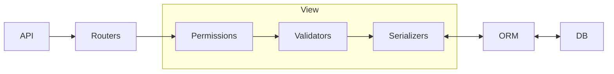

# drf-test

# Ultimate Goal

- [ ] Authentication
    - [ ] JWT
    - [ ] OAuth
- [ ] Security
    - [ ] HMAC
    - [ ] CSRF
    - [ ] CSP
- [ ] Function
    - [ ] Login
    - [ ] Order
    - [ ] Task Queue
- [ ] Performance
    - [ ] Redis
- [ ] Deploy
    - [ ] uwsgi
    - [ ] gunicorn
    - [ ] nginx
- [ ] Cloud
    - [ ] AWS

# API Flow

# Reference

- [Build django-rest-framework](https://medium.com/bandai%E7%9A%84%E6%A9%9F%E5%99%A8%E5%AD%B8%E7%BF%92%E7%AD%86%E8%A8%98/%E6%89%8B%E6%8A%8A%E6%89%8B%E7%A8%8B%E5%BC%8F%E5%AF%A6%E4%BD%9C%E5%88%86%E4%BA%AB%E7%B3%BB%E5%88%97-%E5%BB%BA%E6%A7%8B-django-rest-framework-drf-api-bf7e6e1997e4)
- [django-rest-framework tutorial](https://www.django-rest-framework.org/tutorial/quickstart/)
- [django-oauth-toolkit]https://django-oauth-toolkit.readthedocs.io/en/latest/getting_started.html
